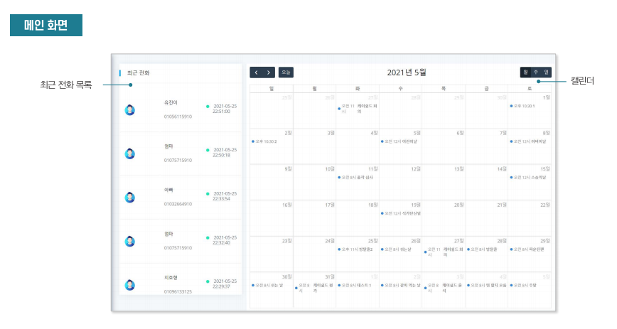
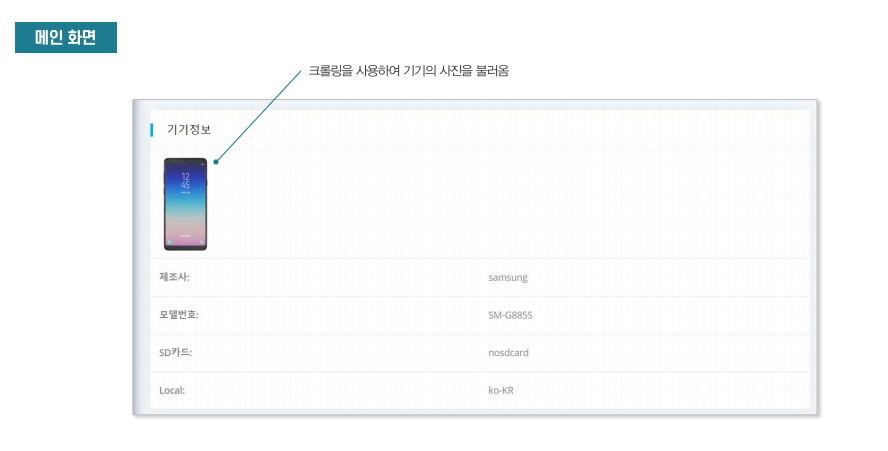
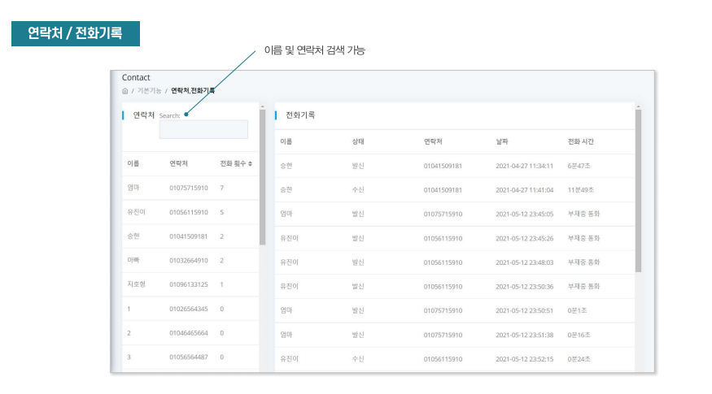
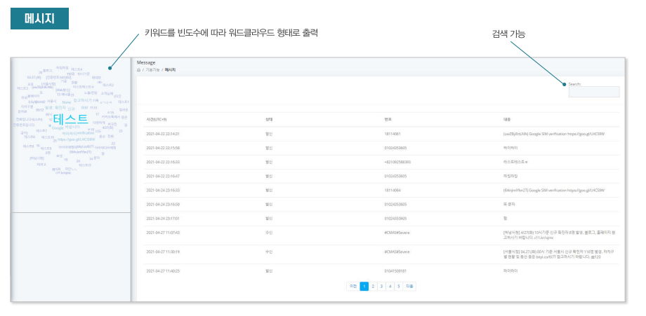
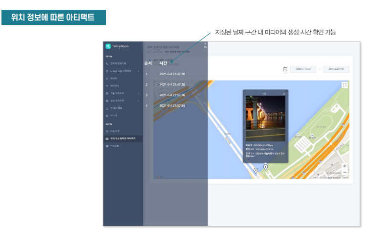
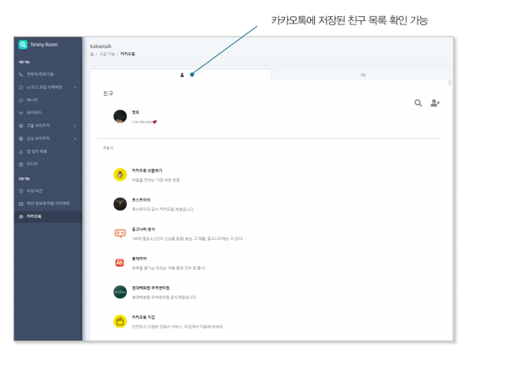
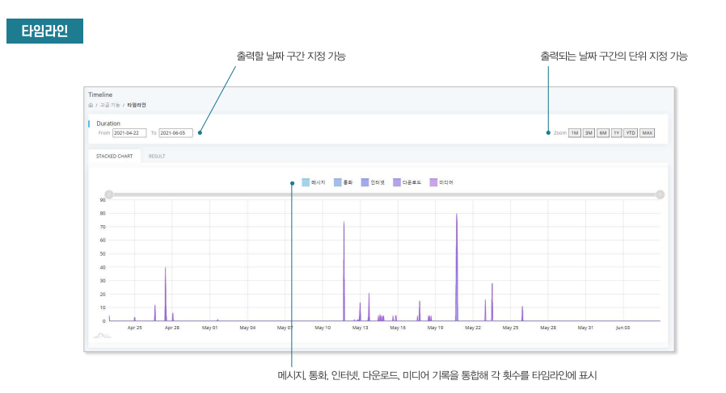

<!-- PROJECT LOGO -->
<br />
<p align="center">
  <a href="http://kshieldjr.org/">
    
  </a>
  <h3 align="center">K-shield.Jr</h3>
  <p align="center">
    K-shield.Jr 6기 사고분석대응 팀 프로젝트
    <br />
</p>


<!-- TABLE OF CONTENTS -->
<details open="open">
  <summary>README.md 목차</summary>
  <ol>
    <li>
      <a href="#프로젝트-내용">프로젝트 내용</a>
    </li>
    <li>
      <a href="#시작전">시작전 설치</a>
      <ul>
        <li><a href="#의존성-설치">의존성 설치</a></li>
        <li><a href="#google-api키-발급">Google Api키 발급</a></li>
      </ul>
    </li>
    <li><a href="#사용용도">사용용도</a></li>
    <li><a href="#프로젝트-기여">프로젝트 기여</a></li>
    <li><a href="#연락처">연락처</a></li>
    <li><a href="#관련-docs">관련 docs</a></li>
  </ol>
</details>


<!-- ABOUT THE PROJECT -->
## 프로젝트 내용
모바일 포렌식을 이용하는 사람들에게 보기 편한 무료의 포렌식 시각화 툴을 제공하는 것</br>
OS:Android.v10 ✔ (IOS ❌)









<!-- GETTING STARTED -->
## 시작전

이 프로젝트를 실행하기전에 필요한 행위.

### 의존성 설치

* requirements.txt
  ```sh
  $ pip install -r requirements.txt
  ```

### Google Api키 발급

1. 키 발급 [https://webruden.tistory.com/378](https://webruden.tistory.com/378)
2. was/templates/geo-Artifact.html의 125Line에 key 파라미터에 발급받은 api key를 넣어주세요.
   ```sh
   <script src="https://maps.googleapis.com/maps/api/js?key=yourkey&libraries=&v=weekly"></script>
   ```


<!-- 사용 용도 -->
## 사용용도

‼보안 목적으로만 사용해주세요‼


<!-- 프로젝트 기여 -->
## 프로젝트 기여


1. 데이터 추출 ✔
2. Djnago 백엔드 작성 ✔
3. 프론트엔드 전반적인 기여 ✔


<!-- 연락처 -->
## 연락처

My Name - [@my_email](https://dldydduq456.com/your_username) - dldydduq456@naver.com


<!-- 관련 docs -->
## 관련 docs
* [python](https://docs.python.org/3/)
* [Django](https://docs.djangoproject.com/ko/3.2/intro/)
* [jQuery](https://api.jquery.com/)
* [googlemap-Api](https://developers.google.com/maps/documentation/javascript/overview)
* [Bootstrap](https://getbootstrap.com/docs/4.1/getting-started/introduction/)
* [html](https://developer.mozilla.org/ko/docs/Web/API/HTMLDocument)
* [javascript](https://developer.mozilla.org/ko/docs/Web/JavaScript)
* [css](https://developer.mozilla.org/ko/docs/Web/CSS)
* [Sqllite3](https://docs.python.org/3/library/sqlite3.html)
* [Qt5](https://doc.qt.io/qtforpython/)


